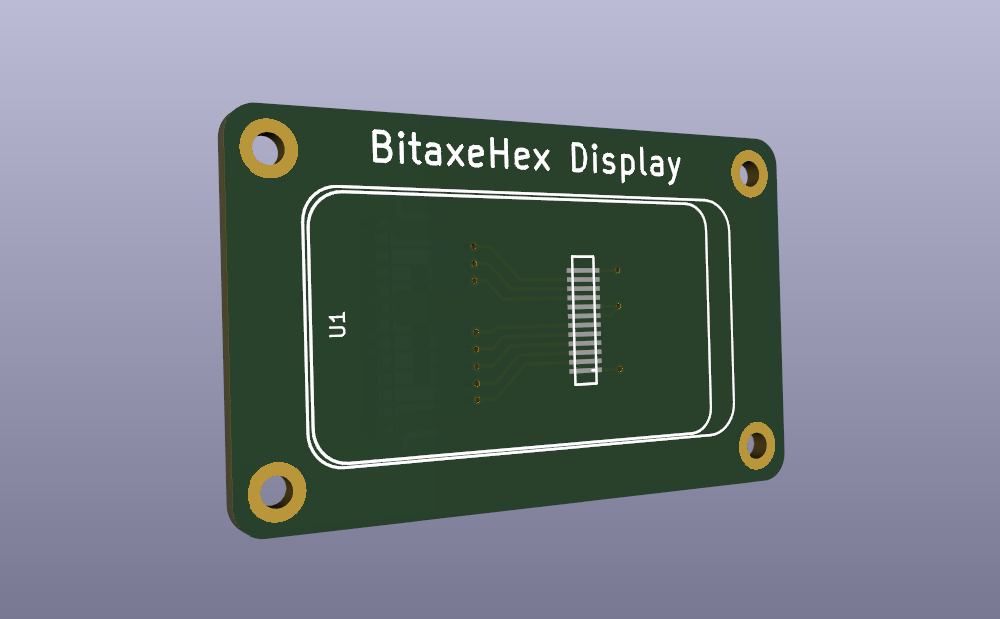
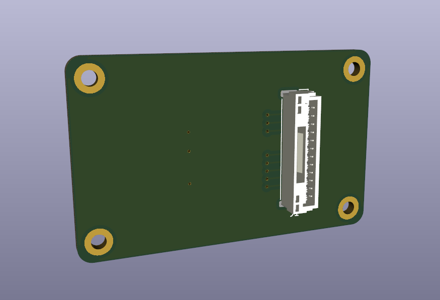

# BitaxeHex display adapter board
This adapater board provides a connection from the BitaxeHex to a 
172x320 SPI interface ST7789 Drive OLED graphic display.  This is 
intended for use on the [bitaxeHex](https://github.com/skot/bitaxeHex).
Currently, the firmware to drive it has not been developed, so this is 
provided in order to facilitate that effort.

The cable to connect it is constructed with a pair of JST-GH 12-pin housings, and 
cables that run straight through.  

## Parts
- [172x320 OLED display](https://www.aliexpress.us/item/3256804691627769.html)
- [JST-GH 12-pin housing](https://www.digikey.com/en/products/detail/jst-sales-america-inc/GHR-12V-S/807824)
- [JST-GH pre-crimped wires](https://www.digikey.com/en/products/detail/jst-sales-america-inc/AGHGH28K305/6009450)

To construct the cable:
- qty 12 of the pre-crimped cables
- qty 2 of the JST-GH housings

Insert the cables into the housings with the locking pin facing the same direction (both towards you)

